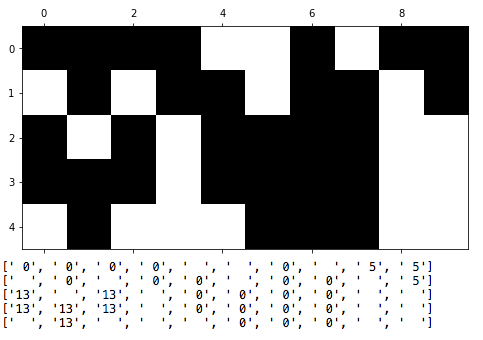

# percolation-python

See [percolation-c](https://github.com/ussserrr/percolation-c) for C version of this program.

# Overview
Model of the two-dimensional percolation phenomena. In a nutshell: we have a 2D grid with the given size (Y,X) and we randomly fill it with the given probability P. After some time we can get the cluster - aggregate of cells - that connects two opposite borders of the grid. In this case we can say that *percolation happened* and call the cluster as *percolated cluster*. Of course, there are may be more than one such cluster but in practice we do not have many of them due to random character of the phenomena. This model can represent (at some level of approximation) a variety of real-world physical systems such as electrical conductivity, fluid flows and so on. We can research such models in different ways, for example find a *percolation threshold* - value of the probability at which at least 60% of all experiments ends with percolation.

# Architecture
There are two methods to search for the percolation. First is a pretty "plane" one and consists in labeling occupied cells according to their belonging to different clusters.

Every cluster is actually a *random graph*. That fact leads us to the second method - represent each cluster as a graph and analyze them.

Though both methods have the same final step (checking for clusters' cells' coordinates to be present at opposite borders of the grid), second method is much simpler because in this case to form the graph (cluster) we just need to declare nodes (occupied cells) and edges (connect necessary nodes using a single loop). However, graph algorithm is a quiet slower than the first one.

Straight method is represented by `percolation.py` (library module) and `percolation_define.py` files. Graph method' code is contained in `percolation_graph.py` (library module) and `percolation_define_graph.py` scripts.

Also two modes of operation are present:
  - **Single experiment**: performs one run, display grid and result. Also percolated clusters are highlighted by colors. Find sample images in `./example_samples/single_experiment` and `example_samples/single_experiment_graph` folders;
  - **Series of experiments**: quietly runs without displaying grids (only progress). At each step we increment the probability of cell occupation and also for every probability perform N experiments. We can plot the relation between some parameter (e.g., fraction of percolated cluster in all occupied cells or fraction of experiments ended with percolation) and probability. Single script `percolation_threshold.py` provide this functionality and uses either both methods for your choice.

  

# Dependencies
  - **matplotlib**: plotting
  - **networkx**: graph library for the graph method

# Some other samples
  - Grid with occupied cells' labels and graph structure:

    
    
  - Grid with table showing labeling mechanism work (first method):

    
  - Source grid image (obviously hard to say whether the percolation is here or not by a human vision):

  
  - Grid with 3 clusters:
  
  
